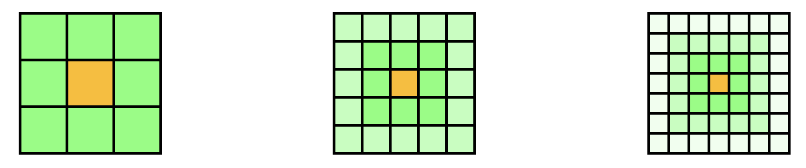

-   [1. Introduction](#1-introduction)
    -   [1.1. Objectif](#11-objectif)
    -   [1.2. Modèles](#12-modèles)
        -   [1.2.1. Modèle SIR(D)](#121-modèle-sird)
        -   [1.2.2. Modèle dérivé du jeu de la vie de Conway](#122-modèle-dérivé-du-jeu-de-la-vie-de-conway)
            -   [Formalisation du modèle](#formalisation-du-modèle)

# 1. Introduction

## 1.1. Objectif

Le principe est de réaliser une étude de l'influence d'un champion sportif sur la pratique de son sport.

> **Exemple :** On souhaite étudier l'influence de Teddy Riner sur la pratique du judo en France sur les 20 dernières années.

## 1.2. Modèles

### 1.2.1. Modèle SIR(D)

Pour modéliser ce système, on peut utiliser un modèle de type [SIR (Susceptible, Infected, Recovered)](https://fr.wikipedia.org/wiki/Mod%C3%A8les_compartimentaux_en_%C3%A9pid%C3%A9miologie) qui est un modèle épidémiologique. Il est composé de 3 états, qui dans notre cas sont :

-   **Susceptible** : Population ne pratiquant pas de sport
-   **Infected** : Population pratiquant le sport
-   **Recovered** : Population ayant arrêté le sport

> **Remarque :** On ajoute parfois un état **Dead** pour les personnes décédées (SIRD).

> **Critique du modèle :**
>
> -   On pourrait vouloir prendre en compte les naissances et les décès, mais cela complexifierait le modèle sans apporter de réelle valeur ajoutée car la période considérée est courte.
> -   Ce modèle considère que la pratique du sport est assimilable à une maladie et se propage de façon similaire, ce qui est un parti pris discutable.
> -   Ce modèle ne prend pas en compte les personnes qui pratiquent plusieurs sports ou les personnes qui arrêtent le sport pour en pratiquer un autre. Cela peut avoir une influence indépendante sur la pratique du sport étudié.

### 1.2.2. Modèle dérivé du jeu de la vie de Conway

Le [jeu de la vie de Conway](https://fr.wikipedia.org/wiki/Jeu_de_la_vie) est un automate cellulaire constitué d'une grille de cellules qui peuvent être dans 2 états : vivante ou morte. L'état d'une cellule évolue en fonction de l'état de ses voisines. Ce jeu est très intéressant car il permet de modéliser des systèmes complexes à partir de règles simples. On peut donc s'en inspirer pour modéliser notre système.

#### Formalisation du modèle

On considère que l'influence de la pratique sportive se fait par l'intermédiaire des amis. On considère que si une personne $A$ est amie avec une personne $B$, alors $B$ est amie avec $A$. Toutefois, si $A$ est amie avec $B$ et $B$ est amie avec $C$, alors $A$ n'est pas forcément amie avec $C$ mais $A$ et $C$ sont liés par la relation "ami d'ami". Pour notre étude, on limite le nombre d'amis à 8 pour simplifier la représentation. Pour le début, on considère même que chaque personne a exactement 8 amis.

Formellement, on définit la relation d'amitié $\leftrightarrow_f$ par :

-   On n'est pas ami avec soi-même : $\forall A \quad \neg (A \leftrightarrow_f A)$
-   Symétrie : $\forall A \forall B \quad A \leftrightarrow_f B \Longrightarrow B \leftrightarrow_f A$
-   On ne peut pas être ami avec plus de 8 personnes : $\forall A \quad |[A]_{\leftrightarrow_f}| = 8$

> **Remarque :** $[A]_{\leftrightarrow_f}$ désigne la classe (:warning: pas classe d'équivalence !) de $A$ pour la relation $\leftrightarrow_f$, i.e. l'ensemble des personnes amies avec $A$.

On définit inductivement la relation généralisant le terme "ami d'ordre $n$" $\leftrightarrow_{f}^n$ par :

-   $\forall A \forall B \quad A \leftrightarrow_f^1 B \equiv A \leftrightarrow_f B$
-   $\forall A \forall B \quad A \leftrightarrow_f^{n+1} B \equiv \exists C \quad A \leftrightarrow_f^n C \wedge C \leftrightarrow_f B$

On note $\leftrightarrow_f^*$ la fermerture transitive de $\leftrightarrow_f$.

**Définition :** Pour une relation $\sim$, on définit la fermeture transitive $\sim^*$ par : $$\sim^* = \bigcup_{n \in \mathbb{N}} \sim^n$$

> **Remarque :** Dans notre cas, $\leftrightarrow_f^*$ désigne toute la population.

On peut donc représenter la relation d'amitié par un graphe non orienté dont les sommets sont les personnes et les arêtes sont les relations d'amitié. Pour simplifier encore, on représente un sommet par un carré et on place les sommets en relation d'amitié côte à côte. Pour une personne donnée, on obtient donc un tableau de carrés de taille $3 \times 3$ si on représente les amis d'ordre 1, $5 \times 5$ si on représente les amis d'ordre 2, $7 \times 7$ si on représente les amis d'ordre 3, etc.

<!-- 

<table class=center>
<tr class="cell">
    <td></td>
    <td></td>
    <td></td>
  </tr>
  <tr class="cell">
    <td></td>
    <td style="background-color:#fb0"></td>
    <td></td>
  </tr>
  <tr class="cell">
    <td></td>
    <td></td>
    <td></td>
  </tr>
</table>

<table class=center>
<tr class="cell">
    <td style="width:21px; height:21px; background-color:#bfb"></td>
    <td style="width:21px; height:21px; background-color:#bfb"></td>
    <td style="width:21px; height:21px; background-color:#bfb"></td>
    <td style="width:21px; height:21px; background-color:#bfb"></td>
    <td style="width:21px; height:21px; background-color:#bfb"></td>
  </tr>
  <tr class="cell">
    <td style="width:21px; height:21px; background-color:#bfb"></td>
    <td style="width:21px; height:21px"></td>
    <td style="width:21px; height:21px"></td>
    <td style="width:21px; height:21px"></td>
    <td style="width:21px; height:21px; background-color:#bfb"></td>
  </tr>
  <tr class="cell">
    <td style="width:21px; height:21px; background-color:#bfb"></td>
    <td style="width:21px; height:21px"></td>
    <td style="width:21px; height:21px; background-color:#fb0"></td>
    <td style="width:21px; height:21px"></td>
    <td style="width:21px; height:21px; background-color:#bfb"></td>
  </tr>
  <tr class="cell">
    <td style="width:21px; height:21px; background-color:#bfb"></td>
    <td style="width:21px; height:21px"></td>
    <td style="width:21px; height:21px"></td>
    <td style="width:21px; height:21px"></td>
    <td style="width:21px; height:21px; background-color:#bfb"></td>
  </tr>
  <tr class="cell">
    <td style="width:21px; height:21px; background-color:#bfb"></td>
    <td style="width:21px; height:21px; background-color:#bfb"></td>
    <td style="width:21px; height:21px; background-color:#bfb"></td>
    <td style="width:21px; height:21px; background-color:#bfb"></td>
    <td style="width:21px; height:21px; background-color:#bfb"></td>
  </tr>
</table>

<table class=center>
<tr class="cell">
    <td style="width:15px; height:15px; background-color:#efe"></td>
    <td style="width:15px; height:15px; background-color:#efe"></td>
    <td style="width:15px; height:15px; background-color:#efe"></td>
    <td style="width:15px; height:15px; background-color:#efe"></td>
    <td style="width:15px; height:15px; background-color:#efe"></td>
    <td style="width:15px; height:15px; background-color:#efe"></td>
    <td style="width:15px; height:15px; background-color:#efe"></td>
  </tr>
  <tr class="cell">
    <td style="width:15px; height:15px; background-color:#efe"></td>
    <td style="width:15px; height:15px; background-color:#bfb"></td>
    <td style="width:15px; height:15px; background-color:#bfb"></td>
    <td style="width:15px; height:15px; background-color:#bfb"></td>
    <td style="width:15px; height:15px; background-color:#bfb"></td>
    <td style="width:15px; height:15px; background-color:#bfb"></td>
    <td style="width:15px; height:15px; background-color:#efe"></td>
  </tr>
  <tr class="cell">
    <td style="width:15px; height:15px; background-color:#efe"></td>
    <td style="width:15px; height:15px; background-color:#bfb"></td>
    <td style="width:15px; height:15px"></td>
    <td style="width:15px; height:15px"></td>
    <td style="width:15px; height:15px"></td>
    <td style="width:15px; height:15px; background-color:#bfb"></td>
    <td style="width:15px; height:15px; background-color:#efe"></td>
  </tr>
  <tr class="cell">
    <td style="width:15px; height:15px; background-color:#efe"></td>
    <td style="width:15px; height:15px; background-color:#bfb"></td>
    <td style="width:15px; height:15px"></td>
    <td style="width:15px; height:15px; background-color:#fb0"></td>
    <td style="width:15px; height:15px"></td>
    <td style="width:15px; height:15px; background-color:#bfb"></td>
    <td style="width:15px; height:15px; background-color:#efe"></td>
  </tr>
  <tr class="cell">
    <td style="width:15px; height:15px; background-color:#efe"></td>
    <td style="width:15px; height:15px; background-color:#bfb"></td>
    <td style="width:15px; height:15px"></td>
    <td style="width:15px; height:15px"></td>
    <td style="width:15px; height:15px"></td>
    <td style="width:15px; height:15px; background-color:#bfb"></td>
    <td style="width:15px; height:15px; background-color:#efe"></td>
  </tr>
  <tr class="cell">
    <td style="width:15px; height:15px; background-color:#efe"></td>
    <td style="width:15px; height:15px; background-color:#bfb"></td>
    <td style="width:15px; height:15px; background-color:#bfb"></td>
    <td style="width:15px; height:15px; background-color:#bfb"></td>
    <td style="width:15px; height:15px; background-color:#bfb"></td>
    <td style="width:15px; height:15px; background-color:#bfb"></td>
    <td style="width:15px; height:15px; background-color:#efe"></td>
  </tr>
  <tr class="cell">
    <td style="width:15px; height:15px; background-color:#efe"></td>
    <td style="width:15px; height:15px; background-color:#efe"></td>
    <td style="width:15px; height:15px; background-color:#efe"></td>
    <td style="width:15px; height:15px; background-color:#efe"></td>
    <td style="width:15px; height:15px; background-color:#efe"></td>
    <td style="width:15px; height:15px; background-color:#efe"></td>
    <td style="width:15px; height:15px; background-color:#efe"></td>
  </tr>
</table>

 -->

Soient $\tau_0$ la proportion initiale de pratiquants du sport étudié, $p$ la probabilité qu'une personne commence à pratiquer le sport étudié de son propre chef (i.e. si aucun de ses amis ne le pratique) et $q$ la probabilité qu'une personne continue à pratiquer le sport étudié de son propre chef (i.e. si aucun de ses amis ne le pratique).

**Ordre 1 :** On définit $f_p^1$ (resp. $f_q^1$) la fonction d'influence à l'ordre $1$ donnant la probabilité de commencer (resp. de continuer) le sport pour un nombre d'amis donné pratiquant ce sport par :
$$f_p^1 \colon n \mapsto \frac{n}{8}(1-p)+p \qquad f_q^1 := f_p^1\Bigr|_{p=q}$$
La fonction $f$ croît linéairement de $p$ à $1$ en fonction du nombre d'amis pratiquant le sport étudié.

> **Remarque :** Pour simuler le fait que certaines personnes ne pratiquent pas de sport même si tous leurs amis le pratiquent, on peut augmenter le dénominateur de la fraction ou remplacer le terme $(1-p)$ par $(\lambda - p)$ avec $\lambda \in [p,1]$.

**Ordre n :** L'idée est de généraliser à un ordre quelconque $n$ en considérant les amis d'ordre $n$ et en considérant que plus une personne est en relation éloignée ($\leftrightarrow_f^n$ avec $n$ grand) avec quelqu'un, moins il aura d'influence sur la personne considérée. On s'intéressera plus tard au cas où on considère un champion sportif comme ami d'ordre $n$.

> **Remarque :** Intuitivement, on peut imaginer une loi exponentielle pour l'influence, i.e l'influence d'un ami d'ordre $n$ contribue à un terme (entre 0 et 1) à la puissance $n$ dans la probabilité.

Soit $f_p^n$ (resp. $f_q^n$) la fonction d'influence à l'ordre $n$ donnant la probabilité de commencer (resp. de continuer) le sport pour un nombre d'amis d'ordre $n$ donné pratiquant ce sport.

> **Remarque :** on a au plus $8n$ amis d'ordre $n$ et au plus $4n(n+1)$ amis d'ordre au plus $n$.

Pour une personne $X$ donnée, la probabilité $P_X$ de commencer le sport est donnée par la somme des contributions de chaque classe d'amis :

$$P_X = \sum_{n=0}^{\infty} f_p^n(|[X]_{\leftrightarrow_f^n}|)$$

> **Remarque :** Les fonctions $f_p^n$ doivent être de telle sorte que $P_X \in [0,1]$ ! Il faut donc déjà que la série converge et il suffit que $\displaystyle\sum_{n=0}^{\infty} f_p^n(8n) \leq 1$ dans le cas où on se limite à 8 amis.

> **Remarque :** On peut considérer que $f_p^n$ est nulle pour $n$ assez grand, sauf si $X$ est ami avec un champion sportif.
